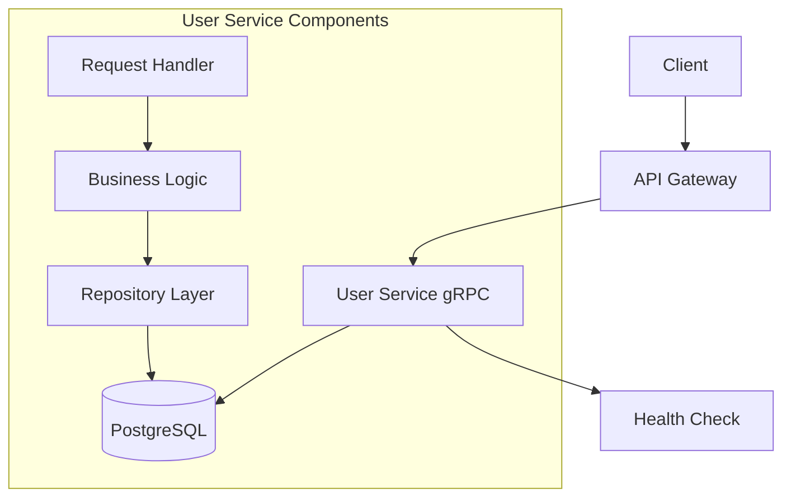
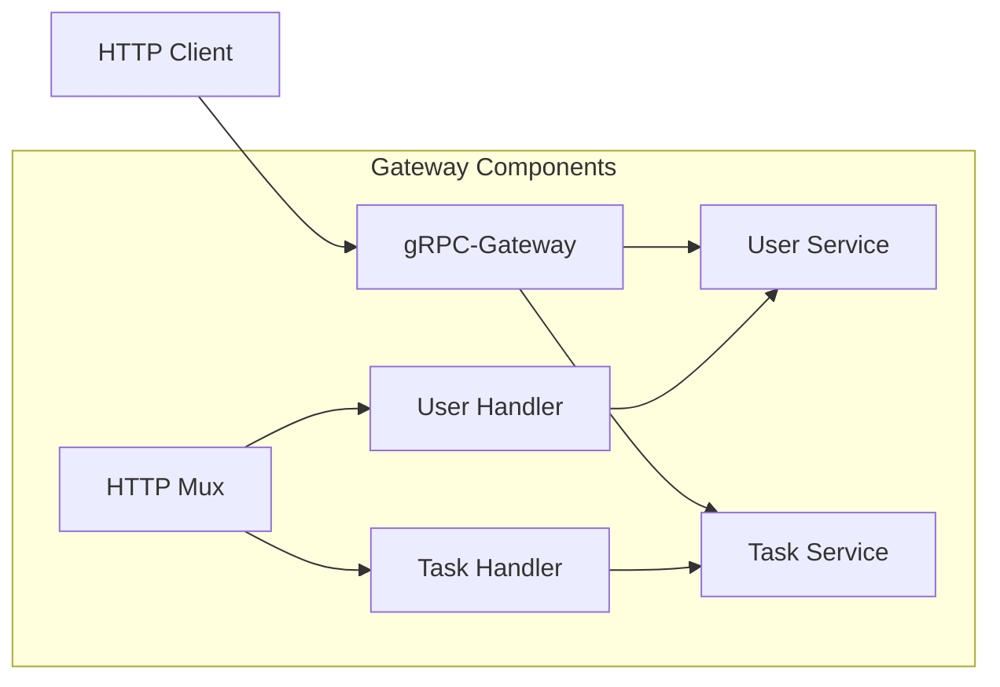
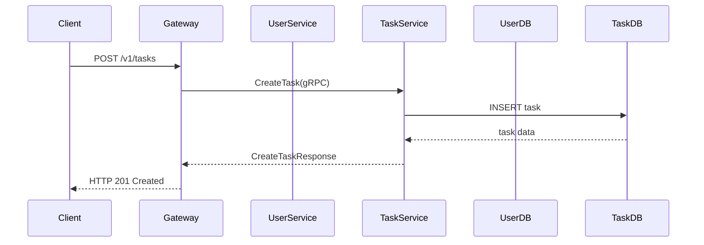
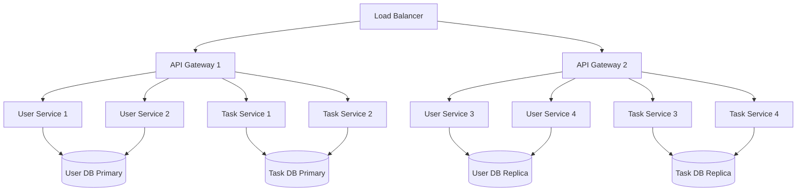
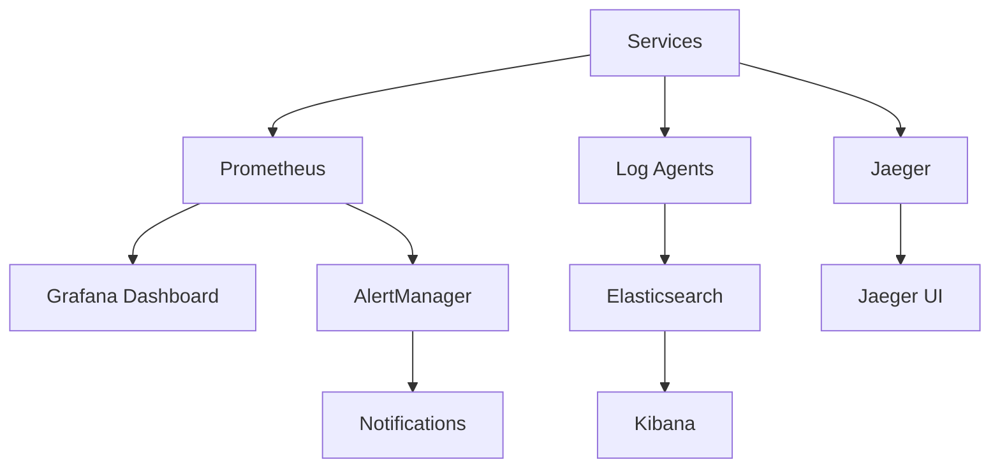

# DTMS Architecture Documentation

## Overview

The Distributed Task Management System (DTMS) is built using a microservices architecture pattern. This document provides a deep dive into the architectural decisions, patterns, and implementation details of the system.

## Architectural Principles

### 1. Single Responsibility Principle
Each service has a single, well-defined responsibility:
- **User Service**: Manages all user-related operations
- **Task Service**: Handles all task-related operations
- **API Gateway**: Provides a unified HTTP/REST interface

### 2. Loose Coupling
Services communicate through well-defined APIs (gRPC) and have minimal knowledge of each other's implementation details.

### 3. High Cohesion
Related functionality is grouped together within each service boundary.

### 4. Database per Service
Each service owns its own database, avoiding shared database anti-patterns.

## Service Architecture

### User Service



**Components:**
- **gRPC Server**: Handles gRPC requests on port 50051
- **HTTP Health Server**: Provides health check endpoint on port 8081
- **Business Logic**: Implements user management operations
- **Repository Layer**: Handles database operations using GORM
- **Database**: PostgreSQL with UUID extension

**Data Model:**
```go
type User struct {
    gorm.Model
    ID        string    `gorm:"type:uuid;default:uuid_generate_v4();primary_key"`
    Username  string    `gorm:"size:255;not null;unique"`
    Email     string    `gorm:"size:255;not null;unique"`
    CreatedAt time.Time `gorm:"default:current_timestamp"`
    UpdatedAt time.Time `gorm:"default:current_timestamp"`
}
```

### Task Service


**Components:**
- **gRPC Server**: Handles gRPC requests on port 50052
- **HTTP Health Server**: Provides health check endpoint on port 8082
- **Business Logic**: Implements task management operations
- **Repository Layer**: Handles database operations using GORM
- **Database**: PostgreSQL with UUID extension

**Data Model:**
```go
type Task struct {
    ID          string    `gorm:"type:uuid;default:uuid_generate_v4();primary_key"`
    Description string    `gorm:"size:255;not null"`
    UserID      string    `gorm:"size:255"`
    CreatedAt   time.Time `gorm:"default:current_timestamp"`
    UpdatedAt   time.Time `gorm:"default:current_timestamp"`
}
```

### API Gateway



**Components:**
- **HTTP Server**: Listens on port 8080
- **gRPC-Gateway Runtime**: Translates HTTP/REST to gRPC
- **Service Handlers**: Routes requests to appropriate services
- **Health Checker**: Verifies service health on startup

## Communication Patterns

### 1. Synchronous Communication
- Services communicate synchronously via gRPC
- The API Gateway acts as an orchestrator
- Immediate response/feedback for client requests

### 2. HTTP/REST Interface
- gRPC-Gateway provides REST endpoints
- Enables easy integration with web clients
- Automatic OpenAPI documentation generation

### 3. Health Check Protocol
- Uses gRPC health checking protocol
- Periodic health verification
- Service readiness checks

## Data Architecture

### Database Design

#### User Database Schema
```sql
-- Users table
CREATE TABLE users (
    id UUID PRIMARY KEY DEFAULT uuid_generate_v4(),
    username VARCHAR(255) UNIQUE NOT NULL,
    email VARCHAR(255) UNIQUE NOT NULL,
    created_at TIMESTAMP DEFAULT CURRENT_TIMESTAMP,
    updated_at TIMESTAMP DEFAULT CURRENT_TIMESTAMP
);

-- Indexes
CREATE UNIQUE INDEX idx_users_username ON users(username);
CREATE UNIQUE INDEX idx_users_email ON users(email);
```

#### Task Database Schema
```sql
-- Tasks table
CREATE TABLE tasks (
    id UUID PRIMARY KEY DEFAULT uuid_generate_v4(),
    description VARCHAR(255) NOT NULL,
    user_id VARCHAR(255),
    created_at TIMESTAMP DEFAULT CURRENT_TIMESTAMP,
    updated_at TIMESTAMP DEFAULT CURRENT_TIMESTAMP
);

-- Indexes
CREATE INDEX idx_tasks_user_id ON tasks(user_id);
```

### Data Flow



## Security Architecture

### Current Security Measures
1. **Network Isolation**: Docker networks isolate services
2. **Database Authentication**: Username/password authentication
3. **Environment Variables**: Sensitive data in environment variables

### Security Gaps (Future Improvements)
1. **Authentication**: No user authentication implemented
2. **Authorization**: No role-based access control
3. **Encryption**: No TLS/SSL for service communication
4. **API Security**: No rate limiting or validation
5. **Secrets Management**: Using plain environment variables

## Scalability Architecture

### Horizontal Scaling
- Each service can be scaled independently
- Docker Compose allows multiple instances
- Load balancer needed for production

### Scaling Strategies
1. **Service Replication**: Multiple instances of each service
2. **Database Scaling**: Read replicas for high read services
3. **Connection Pooling**: Optimize database connections
4. **Caching**: Add Redis for frequently accessed data

### Deployment Architecture



## Technology Stack Details

### gRPC
- **Protocol**: HTTP/2
- **Serialization**: Protocol Buffers
- **Code Generation**: protoc-gen-go-grpc
- **Streaming**: Not currently used (future enhancement)

### GORM
- **ORM Features**: Auto-migration, associations, validations
- **Connection Pooling**: Built-in with database/sql
- **Logging**: Configurable log levels
- **Hooks**: Before/after save, create, delete

### Docker
- **Base Images**: golang:alpine for services, postgres:latest for DB
- **Multi-stage Builds**: Reduce image size
- **Health Checks**: Built-in Docker health checks
- **Volumes**: Persistent data storage

## Performance Considerations

### Database Optimization
1. **Indexes**: Primary keys on UUIDs, unique on username/email
2. **Connection Pooling**: GORM's default pool management
3. **Query Optimization**: Use GORM's efficient query building

### Service Optimization
1. **gRPC**: Binary serialization, HTTP/2 multiplexing
2. **Concurrency**: Go's goroutines for concurrent requests
3. **Memory**: Efficient memory management in Go

### Monitoring Points
1. **Request Latency**: gRPC interceptor middleware
2. **Database Metrics**: Connection pool status, query times
3. **Resource Usage**: CPU, memory, network I/O
4. **Error Rates**: Failed requests, database errors

## Future Architectural Improvements

### 1. Event-Driven Architecture
- Implement event sourcing
- Add message broker (Kafka/RabbitMQ)
- Asynchronous communication

### 2. CQRS Pattern
- Separate read and write models
- Optimized read views
- Eventual consistency

### 3. Service Mesh
- Istio/Linkerd for service communication
- Traffic management
- Observability

### 4. API Gateway Enhancements
- Authentication middleware
- Rate limiting
- Request transformation
- API versioning

### 5. Database Improvements
- Database migrations management
- Backup strategies
- Multi-region replication

## Design Decisions Rationale

### Why gRPC?
- **Performance**: Binary serialization, HTTP/2
- **Code Generation**: Type-safe client/server code
- **Streaming**: Future support for real-time updates
- **Cross-language**: Interoperability

### Why Database per Service?
- **Autonomy**: Services can evolve independently
- **Performance**: Optimized schemas per service
- **Failure Isolation**: Database issues don't cascade
- **Technology Choice**: Different databases per service needs

### Why Docker Compose?
- **Simplicity**: Easy local development
- **Consistency**: Same environment across dev/test
- **Portability**: Works anywhere Docker runs
- **Productivity**: Fast setup and teardown

## Deployment Patterns

### Development
- Single host deployment
- Local Docker Compose
- Shared networks
- Direct port exposure

### Production Recommendations
- Container orchestration (Kubernetes)
- Service discovery
- Load balancing
- Blue-green deployments
- Canary releases

## Monitoring and Observability

### Current Monitoring
- Health check endpoints
- Docker logs
- Container status

### Recommended Enhancements
1. **Metrics**: Prometheus + Grafana
2. **Logging**: ELK stack (Elasticsearch, Logstash, Kibana)
3. **Tracing**: Jaeger/Zipkin for distributed tracing
4. **Alerting**: AlertManager for critical alerts

### Monitoring Architecture
